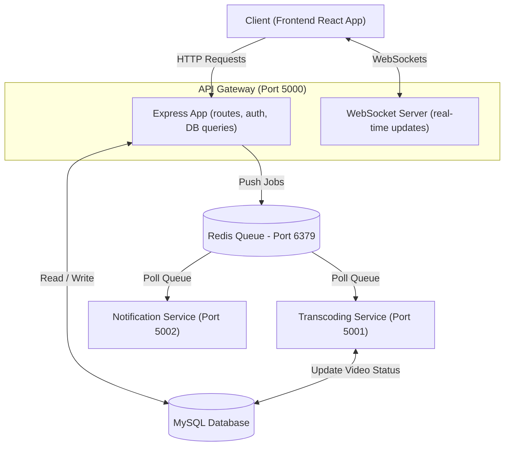

# StreamVault Backend Microservices Architecture

Welcome to the backend architecture guide for StreamVault. This document explains in simple terms how the different components of our backend system interact, where a user's request goes, and how background tasks are processed.

---

## 1. System Architecture Overview

In a monolithic backend, all tasks (user accounts, uploading videos, sending emails) are handled by a single application. 
StreamVault uses a **Microservices Architecture**. Instead of one giant application, we divide responsibilities among three specialized services that run independently and communicate via a message broker (**Redis**).

### Component Map
* **Client (Frontend)**: The user interface (React app) running in the browser.
* **API Gateway** (`api-gateway`): The main door to the backend. It receives all web requests.
* **Database (MySQL)**: The memory of the system. Stores users, video records, payments, etc.
* **Message Broker (Redis Queue)**: A storage area for tasks that take a long time (like converting a video or sending an email) so they can be processed in the background.
* **Transcoding Service** (`transcoding-service`): A worker service that converts uploaded videos into streamable formats (HLS) using FFmpeg.
* **Notification Service** (`notification-service`): A worker service that sends emails, text messages (SMS), or push notifications.



---

## 2. Step-by-Step Request Workflow (Example: Uploading a Video)

To understand how the services work together, let's walk through what happens when a user uploads a new video.

### The Problem with Single-Server Uploads
Converting a video file (transcoding) is very heavy work that can take minutes or hours. If the main server did this directly while the user waited:
1. The user's browser would freeze waiting for a response.
2. The server would become extremely slow for other users.
3. If the server crashed, the progress would be lost.

### The Microservices Solution
Here is the step-by-step path a video upload takes:

```mermaid
sequenceDiagram
    autonumber
    actor User as User Browser
    participant GW as API Gateway (Port 5000)
    database DB as MySQL Database
    participant RD as Redis Queue (Port 6379)
    participant TS as Transcoding Service (Port 5001)
    participant NS as Notification Service (Port 5002)

    User->>GW: 1. Upload Video & Metadata
    Note over GW: Authenticates user &<br/>saves raw file locally
    GW->>DB: 2. Insert video record (Status: 'pending')
    GW->>RD: 3. Add transcode job to queue
    GW-->>User: 4. Respond: "Upload Successful! Processing video..."
    
    Note over TS: Idle Transcoding worker<br/>picks up job from Redis
    TS->>TS: 5. Transcodes video to HLS (FFmpeg)
    TS->>DB: 6. Update video status (Status: 'completed')
    TS->>RD: 7. Trigger "Video Ready" email job
    
    Note over NS: Idle Notification worker<br/>picks up job from Redis
    NS->>User: 8. Sends Email notification to user
```

### Detailed Breakdown of the Steps:

#### Step 1: The Request Hits the API Gateway
* **Where it goes:** The browser sends the video file to `http://localhost:5000/api/videos/upload`.
* **What happens:** The API Gateway ([backend/src/server.js](./backend/src/server.js)) checks if the user is logged in, validates the file, and temporarily saves the raw video file.

#### Step 2: Database Record Created
* **Where it goes:** API Gateway writes to MySQL.
* **What happens:** A new row is inserted into the database with a status of `pending`. The system now knows a new video exists but isn't ready to play yet.

#### Step 3: Job Enqueued in Redis
* **Where it goes:** API Gateway pushes a message containing the video ID to Redis.
* **What happens:** BullMQ (a Node.js queue library) creates a task in Redis.

#### Step 4: Fast Response to the User
* **Where it goes:** Back to the user's browser.
* **What happens:** The Gateway immediately responds with a status message saying: *"Your video has been uploaded and is being processed."* The user does not have to wait for the conversion to finish. They can browse the site or close the tab safely.

#### Step 5: Transcoding Service Processes the Video
* **Where it goes:** The Transcoding Service ([backend/services/transcoding/server.js](./backend/services/transcoding/server.js)) is listening to Redis.
* **What happens:** It sees a new job. It runs FFmpeg to convert the raw video (like an `.mp4` file) into **HLS format** (which cuts the video into tiny 10-second segments so it streams smoothly, adjusting quality to the viewer's internet speed).

#### Step 6: Database Updated
* **Where it goes:** Transcoding Service updates MySQL.
* **What happens:** Once transcoding is complete, the service updates the database record status to `completed` and stores the links to the streamable files.

#### Step 7 & 8: Notification Dispatched
* **Where it goes:** Transcoding service pushes an email job to Redis, which is picked up by the Notification Service ([backend/services/notification/server.js](./backend/services/notification/server.js)).
* **What happens:** The Notification Service sends an email or SMS to the user letting them know *"Your video is ready to watch!"*

---

## 3. Microservices Configuration Files

The microservices are managed and configured in these key files:

* **[backend/pm2.config.js](./backend/pm2.config.js)**: Configures the process manager (**PM2**) to run all three services concurrently in development or production.
* **[backend/docker-compose.yml](./backend/docker-compose.yml)**: Orchestrates Docker containers for the MySQL database, Redis cache, and services.
* **[backend/.env](./backend/.env)**: Defines variables, including where the database and Redis servers are located (`REDIS_HOST` and `REDIS_PORT`).
