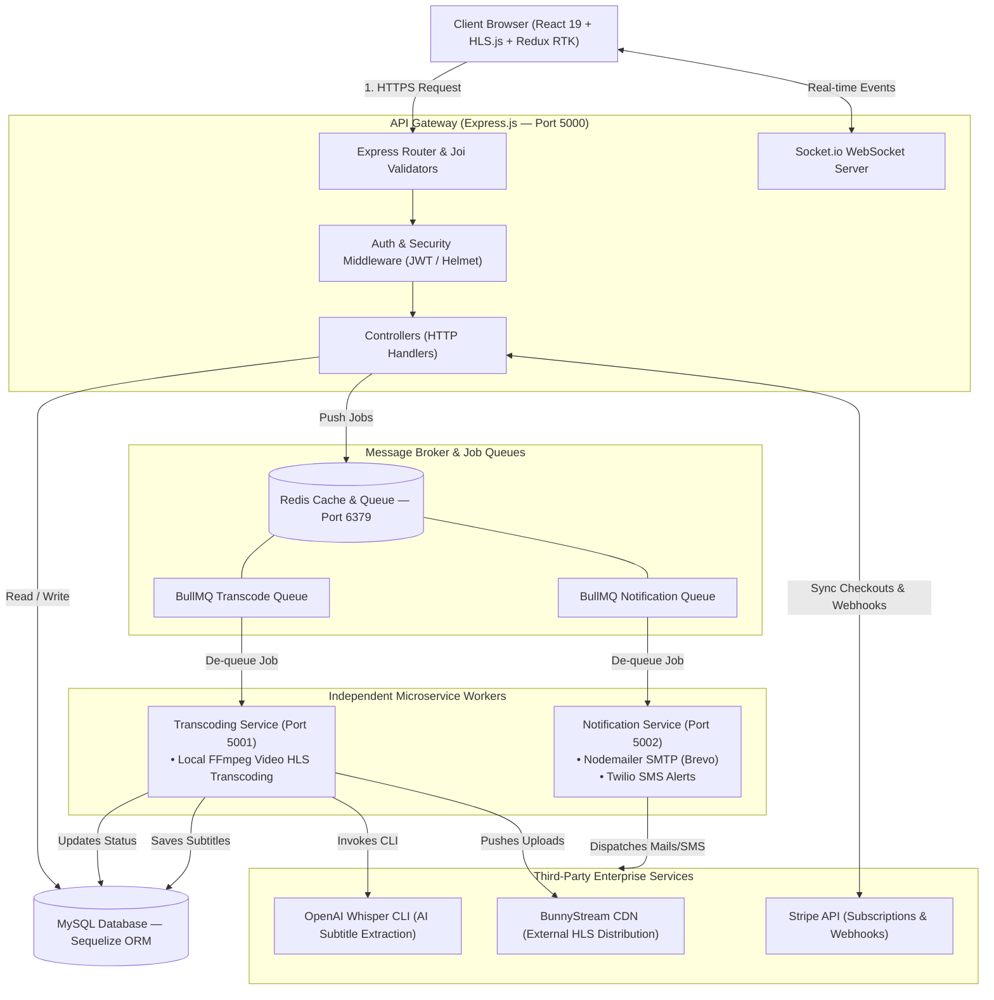

# StreamVault — Complete Technical Architecture & Optimization Guide

This document provides a highly detailed, client-ready overview of the **StreamVault** system architecture, including package descriptions, AI technologies, core flows, CDN capabilities, and optimization strategies. Use this guide to explain the platform's engineering design to technical stakeholders and clients.

---

## 1. High-Level Concept Diagram

The following Mermaid diagram maps the end-to-end data flow, request lifecycle, media uploads, and third-party integrations across the **StreamVault** ecosystem.



---

## 2. Technology Stack & Packages Breakdown

StreamVault uses a modular node-based ecosystem optimized for high throughput, heavy media processing, and real-time user updates.

### A. Frontend Stack (React SPA)
Located in the project root directories, the frontend is built on **React 19** with **Vite** and structured via **TypeScript**.

| Package | Purpose | Client-Facing Technical Value |
| :--- | :--- | :--- |
| `react` & `react-dom` (v19.2) | Core UI Library | Supports fast rendering via Concurrent Mode and React Server Components compatibility. |
| `vite` & `@vitejs/plugin-react` | Build Tool & Bundler | Extremely fast Hot Module Replacement (HMR) and optimized rollup bundle splitting for page load speeds. |
| `@reduxjs/toolkit` & `react-redux` | State Management | Centralized store managing active subscriptions, user authentication, and video watch history tracking. |
| `redux-persist` | Cache Persistence | Saves logged-in user credentials locally, avoiding repetitive authentication queries. |
| `hls.js` (v1.6) | Adaptive Streaming Player | Enables HTTP Live Streaming (HLS) directly on HTML5 video players for smooth, adaptive bitrate scaling. |
| `@stripe/stripe-js` & `@stripe/react-stripe-js` | Payment UI Components | Implements secure, PCI-compliant Stripe checkout frames directly in the browser. |
| `@tailwindcss/vite` & `tailwindcss` | CSS Engine | Modern utility styling ensuring fully responsive grids and sleek dark-mode aesthetics. |
| `react-router-dom` (v7) | Application Routing | Handles smooth, instant client-side page transitions without page reloads. |
| `zod` & `react-hook-form` | Input Schema Validation | Blocks incorrect inputs and displays immediate errors, protecting frontend forms. |
| `recharts` | Dashboard Analytics | Renders interactive subscriber counts and revenue graphs in the admin panel. |

---

### B. Backend Stack (Express + Microservices)
Located in `backend/package.json`, the backend utilizes a distributed queue architecture.

| Package | Purpose | Client-Facing Technical Value |
| :--- | :--- | :--- |
| `express` | Web Framework | Lightweight REST API core providing fast, un-opinionated routing and middleware execution. |
| `sequelize` & `mysql2` | database ORM & Driver | Maps SQL tables to Javascript objects, protecting against SQL-Injection out-of-the-box. |
| `bullmq` & `ioredis` | Job Queue & Broker client | Redis-backed message broker executing heavy operations asynchronously (e.g. transcoding/emails). |
| `ffmpeg-static` & `fluent-ffmpeg` | Local Media Transcoder | Embeds static FFmpeg binaries to convert local user uploads into multi-resolution streamable fragments. |
| `stripe` | Subscription Billing | Syncs pricing models, active subscriber webhooks, payment methods, and invoice cycles. |
| `twilio` | SMS Notifications | Sends instant texts to users for security confirmations (parental settings, billing alerts). |
| `nodemailer` | Email Dispatcher | Integrates SMTP mail transport to deliver sign-in receipts, security alerts, and system invitations. |
| `pdfkit` | PDF Invoicing | Renders real-time billing PDF receipt attachments sent via emails. |
| `jsonwebtoken` & `bcryptjs` | Security / Encryption | Handles secure user authentication (salted SHA hashes and expiring JWT auth tokens). |
| `helmet` & `express-rate-limit` | Security Hardening | Prevents DDoS attacks, brute-force hacking, and adds crucial HTTP security headers. |
| `socket.io` | Real-time Communication | Establishes WebSocket channels to send instant progress logs (e.g., transcoding status) to the UI. |
| `joi` | Server Input Validator | Enforces rigid JSON constraints on API requests before executing database modifications. |
| `winston` | Logging Infrastructure | Standardizes error tracing and operational log audits, written to external log files. |

---

## 3. AI Capabilities: OpenAI Whisper Integration

StreamVault uses **OpenAI Whisper** (an advanced Speech-to-Text neural net) to automate closed-captioning (subtitles) for all media items.

### A. Subtitle Workflow Ingestion
When a video file is processed by the backend ingest pipe:
1. The video file is stored locally in the temporary uploads folder.
2. The subtitle generator module `backend/src/helpers/subtitleGenerator.js` is triggered.
3. The generator checks if the local Whisper CLI tool is installed (checking `/home/cis/.local/bin/whisper` or matching `which whisper`).
4. If found, a sub-process executes:
   ```bash
   PATH="[ffmpeg-static-path]:$PATH" whisper "[temp_video.mp4]" \
     --task transcribe \
     --output_format vtt \
     --output_dir "backend/uploads/subtitles"
   ```
5. **Robust Fallback**: If Whisper is not installed on the system (e.g. during lightweight development runs), the module intercepts the error and outputs a mock synchronized WebVTT caption file containing introduction, dialogue, and outro lines so the media player does not break.
6. The resulting `.vtt` file is mapped to the database record, serving synchronized closed-captions to the client player.

### B. Business Benefits of local Whisper AI
* **Cost-Efficient**: Operates locally on the server without consuming expensive API charges (totally free execution).
* **Accessibility Compliance**: Meets standard global requirements (e.g., ADA, WCAG) by providing accurate captions.
* **Multilingual Transcription**: Whisper automatically detects audio languages (English, Spanish, French, etc.) and transcribes or translates them into English subtitles.

---

## 4. Video CDN Capabilities: BunnyStream

To support thousands of concurrent watchers without slowing down the primary Node.js application, StreamVault integrates **BunnyStream CDN**.

```
[Local Admin Upload] 
       │
       ▼
[Express Server] ───► uploads to ───► [BunnyCDN Ingestion API]
                                             │
                                             ├─► Transcodes automatically into HLS
                                             │
[User Playback Request]                      ▼
[HLS Player] ◄──── CDN Edge Server ◄──── [BunnyCDN Edge Pull Zones]
                     (Signed Token Auth)
```

### Key CDN Features Implemented
* **Offloaded Transcoding**: Admin video uploads are stored locally and immediately pushed to BunnyStream. Bunny CDN handles multi-bitrate conversion, freeing up host CPU.
* **HLS Delivery**: Generates HLS playlists (`playlist.m3u8`) splitting files into 10-second segments. The player adapts quality on-the-fly depending on the user's connection.
* **Token Authentication (Signed Playback URLs)**:
  * To prevent hotlinking (users copying video links and embedding them elsewhere), URLs are signed using SHA-256 tokens linked to an expiration timestamp (4 hours):
    $$\text{Token} = \text{Base64Url}(\text{SHA256}(\text{TokenKey} + \text{basePath} + \text{expiry}))$$
  * Attempting to access the CDN stream link without a fresh token or past expiration results in an HTTP 403 Forbidden error.
* **Secure Embed Iframe**: Generates token-secured embed URLs pointing to Bunny's secure `iframe.mediadelivery.net`.

---

## 5. Architectural Optimization Strategies

To prepare the StreamVault application for enterprise scale (100k+ users), the following technical optimizations are recommended:

### A. AI Subtitle Optimization
* **CUDA GPU Acceleration**: Currently, Whisper runs in Python subprocesses. If running on a CPU, this can take a long time. Configuring the server host with an Nvidia GPU and linking Whisper to CUDA reduces transcription times by up to **90%**.
* **Faster-Whisper Migration**: Replace the standard Python CLI with the C++ based `faster-whisper` library, which runs up to 4x faster with less memory.
* **Cloud API Hybrid**: For high-volume servers, configure a fallback to the OpenAI cloud `/v1/audio/transcriptions` API to handle massive queues under load.

### B. Video Encoding & CDN Tuning
* **Async Ingestion Queue**: Integrate video uploads directly into the BullMQ background worker system instead of blocking the main API thread.
* **Direct-to-CDN Uploads**: Implement S3-compatible pre-signed upload URLs. This allows admin browsers to upload files directly to BunnyCDN storage without going through the Express gateway, saving server bandwidth.

### C. Backend Queue & Threading
* **BullMQ Concurrency Settings**: Set explicit worker concurrency levels in `transcodingWorker.js` and `notificationWorker.js`:
  ```javascript
  const worker = new Worker('TranscodeQueue', processJob, { concurrency: 2 });
  ```
* **Redis Clustering**: Separate the Redis instances used for BullMQ queue state from standard session caches to ensure job operations do not delay user interactions.

### D. Database & Query Performance
* **Query Indexing**: Verify that database indexes exist for critical query targets, especially `users(email)`, `watch_history(user_id, movie_id)`, and `episodes(series_id)`.
* **Sequelize Connection Pool**: Optimize Sequelize's configuration for active pool sizing to prevent database exhaustion under load:
  ```javascript
  pool: { max: 100, min: 10, acquire: 30000, idle: 10000 }
  ```
* **Read Replicas**: Configure Sequelize to route heavy read-only API requests (e.g. landing page content grids) to a read-replica MySQL instance, keeping the primary writer database available for payments and logins.

### E. Frontend Asset Loading
* **Route Lazy Loading**: Implement React `lazy()` and `Suspense` for large paths (such as the admin panel or settings pages) to split the core bundle size.
* **HLS Buffer Preloading**: Tune `HLS.js` configuration settings to load only 2-3 segments ahead, reducing bandwidth usage from users clicking on videos and immediately closing them.
